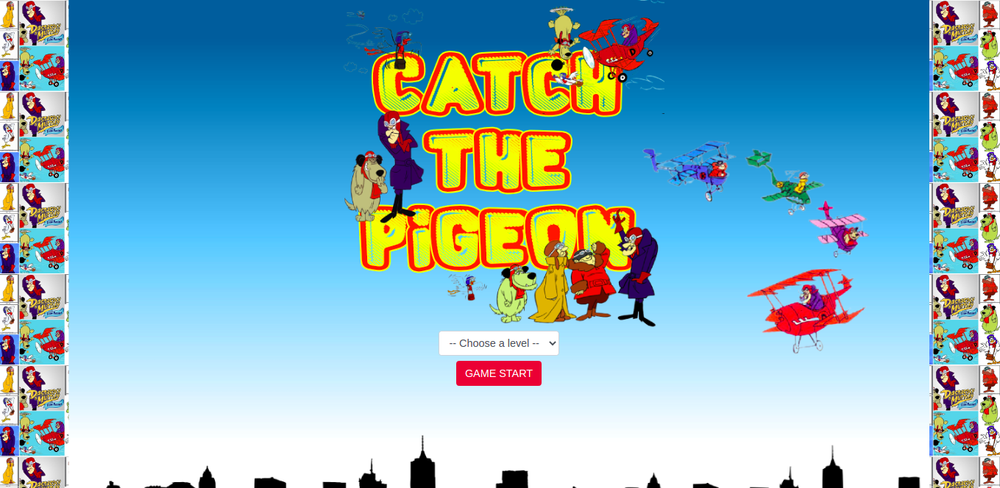

# **Catch The Pigeon**

(Project Module 1 Ironhack)

 

 Click [HERE](https://jhonatanveras.github.io/Project-Game-CatchThePigeon/) to play **Catch The Pigeon**

### Introduction

* Project module 1, Web Development course Ironhack wdpt may 2021.

* The game is based on the cartoon Dick and Muttley (Catch the Pigeon). In the cartoon the main goal of Dick and his team is to capture the pigeon in order not to lose their medals to the general.
Your objective in the game is not much different, to capture the pigeons that appear on the screen, clicking on them so as not to lose your medals, within a certain time.

## 🚀 How to play

* Select a level - Medium, Hard, Ironhack.
* Click on the pigeon that will appear on the screen to capture
* You have 17 seconds to protect your medals and capture as many pigeons as you can.

### 📋 Requirements to play

* Internet
* A quick glance and I'll answer

## 📦 Development

* HTML
* CSS
* JAVASCRIPT 

## 🛠️ Built with

* Coded arts (images)
* Music (YouTube)
* Encoded videos.  

### To come

* GitHub pages hosted so you can play anywhere! (as long as internet is available).
* If you like the game, let me know, maybe I'll try to improve something.

### 🎁 Expressions of gratitude

* I would like to thank the **Ironhack** school for the experience and learning that is provided to us.
The teachers **Daniel K Albanez (DK)**, **Gabriel Sicuto** and **Júlia Foresti**, for the way that the content is presented in the classroom and the support of doubts inside and outside the classroom.
Thank you very much for this first module 🤓.

---
**Developer:** ⌨️ com ❤️ por [Jhonatan Veras](https://github.com/jhonatanveras) 😊
